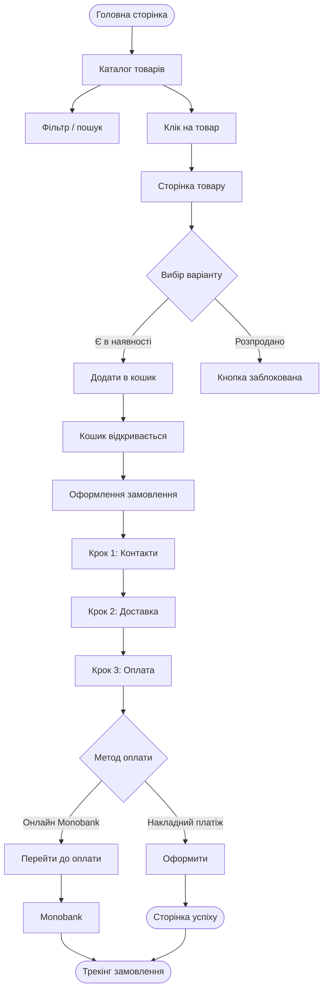
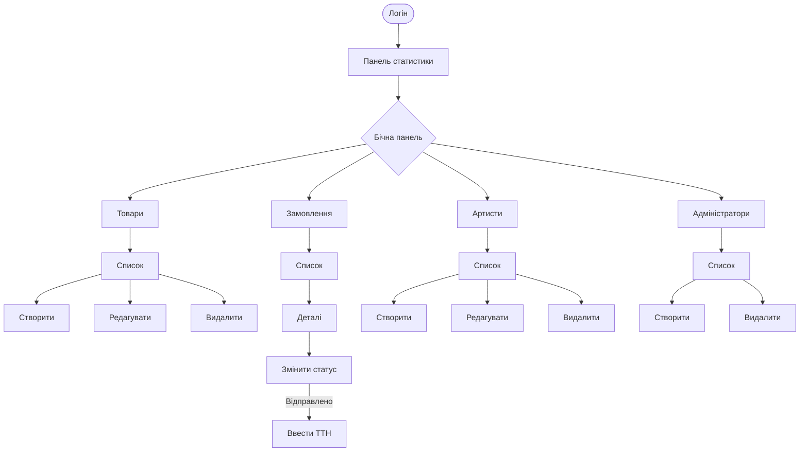
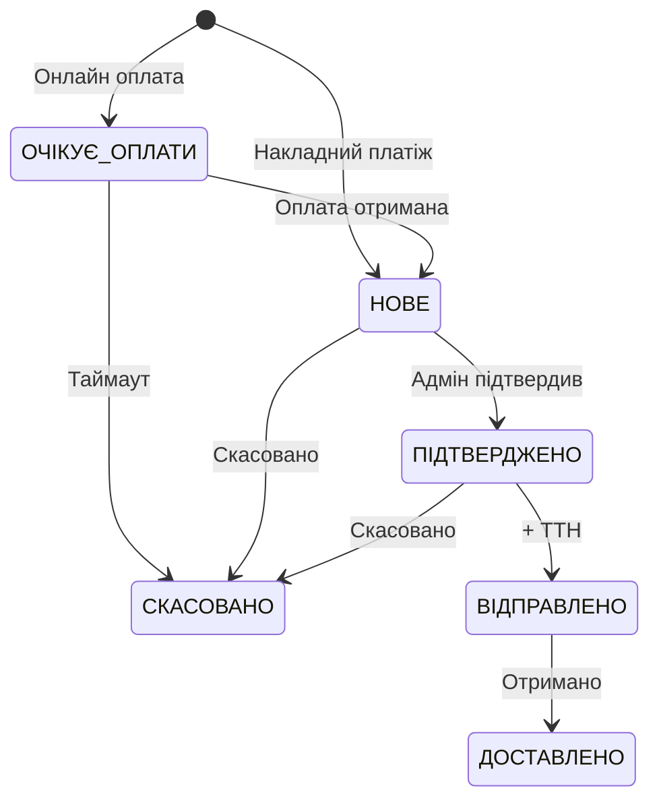
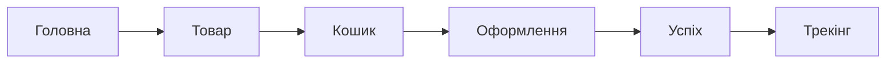
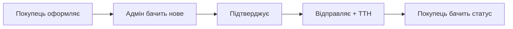

# Africa Shop — Мануальне тестування

> Чеклист мануального тестування всіх функцій сайту.
> Ролі: **Покупець** (публічна частина) та **Адміністратор** (панель управління).

---

## Зміст

1. [Діаграми потоків](#діаграми-потоків)
2. [Покупець](#покупець)
3. [Адміністратор](#адміністратор)
4. [Наскрізні сценарії](#наскрізні-сценарії)

---

## Діаграми потоків

### Покупець — шлях від каталогу до замовлення

### Адмін — управління магазином

### Статуси замовлення

---

## Покупець

### 1. Головна сторінка (`/`)

| # | Тест | Результат |
|---|------|-----------|
| 1.1 | - [ ] Сторінка завантажується без помилок | |
| 1.2 | - [ ] Героїчна секція відображається коректно | |
| 1.3 | - [ ] Сітка товарів завантажується | |
| 1.4 | - [ ] Фільтрація товарів працює | |
| 1.5 | - [ ] Нескінченна прокрутка підвантажує нові товари | |
| 1.6 | - [ ] Клік на картку товару веде на сторінку товару | |
| 1.7 | - [ ] На картці відображається: зображення, назва, артист, ціна | |
| 1.8 | - [ ] На мобільному прокрутка з фіксацією працює | |

### 2. Сторінка товару (`/product/[slug]`)

| # | Тест | Результат |
|---|------|-----------|
| | **Відображення** | |
| 2.1 | - [ ] Назва товару відображається | |
| 2.2 | - [ ] Ціна відображається | |
| 2.3 | - [ ] Ім'я артиста відображається (якщо прив'язаний) | |
| 2.4 | - [ ] Опис товару відображається | |
| | **Галерея зображень** | |
| 2.5 | - [ ] Головне зображення відображається | |
| 2.6 | - [ ] Мініатюри під головним зображенням | |
| 2.7 | - [ ] Клік на мініатюру змінює головне фото | |
| 2.8 | - [ ] Повноекранний режим відкривається | |
| 2.9 | - [ ] Повноекранний режим закривається кнопкою × | |
| 2.10 | - [ ] Повноекранний режим закривається клавішею Escape | |
| | **Вибір варіантів** | |
| 2.11 | - [ ] Селектори атрибутів відображаються (розмір, колір тощо) | |
| 2.12 | - [ ] Клік обирає значення атрибуту | |
| 2.13 | - [ ] Недоступні значення відображені сірим і не клікабельні | |
| 2.14 | - [ ] Ціна оновлюється при зміні варіанту | |
| 2.15 | - [ ] Якщо всі варіанти розпродані — показується "Розпродано" | |
| | **Додавання в кошик** | |
| 2.16 | - [ ] Кнопка "Додати в кошик" заблокована поки не обрано всі атрибути | |
| 2.17 | - [ ] Кнопка стає активною після вибору всіх атрибутів (якщо є залишок) | |
| 2.18 | - [ ] Клік на кнопку додає товар у кошик | |
| 2.19 | - [ ] Бічна панель кошика відкривається автоматично | |
| 2.20 | - [ ] Анімація пульсації на кнопці кошика в шапці | |
| | **Помилки** | |
| 2.21 | - [ ] Неіснуючий slug — сторінка 404 | |

### 3. Сторінка артиста (`/artist/[slug]`)

| # | Тест | Результат |
|---|------|-----------|
| 3.1 | - [ ] Ім'я артиста відображається | |
| 3.2 | - [ ] Біографія відображається | |
| 3.3 | - [ ] Фото артиста відображається | |
| 3.4 | - [ ] Соціальні посилання відображаються (Instagram, Spotify, YouTube, TikTok, SoundCloud, сайт) | |
| 3.5 | - [ ] Кожне посилання відкривається в новій вкладці | |
| 3.6 | - [ ] Товари артиста відображаються списком | |
| 3.7 | - [ ] Пагінація товарів працює | |
| 3.8 | - [ ] Кнопка "Назад" працює | |

### 4. Кошик

| # | Тест | Результат |
|---|------|-----------|
| | **Кнопка в шапці** | |
| 4.1 | - [ ] Клік на "Кошик" відкриває бічну панель | |
| 4.2 | - [ ] Лічильник в дужках показує кількість товарів | |
| 4.3 | - [ ] При 0 товарів лічильник прихований | |
| 4.4 | - [ ] При додаванні товару — анімація пульсації | |
| | **Бічна панель** | |
| 4.5 | - [ ] Затемнення фону з ефектом розмиття | |
| 4.6 | - [ ] Панель висувається знизу з анімацією | |
| 4.7 | - [ ] Клік на затемнення закриває панель | |
| 4.8 | - [ ] Кнопка × закриває панель | |
| 4.9 | - [ ] Прокрутка основної сторінки заблокована | |
| | **Порожній кошик** | |
| 4.10 | - [ ] Відображається напис "Кошик порожній" | |
| | **Товари в кошику** | |
| 4.11 | - [ ] Кожен товар: зображення, назва, варіант, ціна за одиницю | |
| 4.12 | - [ ] Кнопка "+" збільшує кількість на 1 | |
| 4.13 | - [ ] Кнопка "−" зменшує кількість на 1 | |
| 4.14 | - [ ] При зменшенні до 0 — товар видаляється | |
| 4.15 | - [ ] Кнопка × видаляє товар з кошика | |
| 4.16 | - [ ] Сума рядка = ціна × кількість | |
| 4.17 | - [ ] Загальна сума внизу розрахована коректно | |
| | **Кнопка "Оформити замовлення"** | |
| 4.18 | - [ ] Кнопка видима коли є товари | |
| 4.19 | - [ ] Клік веде на /checkout | |
| 4.20 | - [ ] Панель закривається при переході | |
| | **Збереження** | |
| 4.21 | - [ ] Перезавантажити сторінку — товари на місці | |
| 4.22 | - [ ] Закрити вкладку і відкрити знову — товари на місці | |
| 4.23 | - [ ] Додати той самий товар двічі — кількість збільшується, дублікат не створюється | |

### 5. Оформлення замовлення (`/checkout`)

#### 5.0 Загальне

| # | Тест | Результат |
|---|------|-----------|
| 5.0.1 | - [ ] Якщо кошик порожній — відображається "Повернутися до магазину" | |
| 5.0.2 | - [ ] Нумерація кроків (01 / 02 / 03) видима | |
| 5.0.3 | - [ ] На десктопі — дві колонки (форма + зображення) | |
| 5.0.4 | - [ ] На мобільному — одна колонка | |

#### 5.1 Крок 1 — Контакти

| # | Тест | Результат |
|---|------|-----------|
| 5.1.1 | - [ ] Поле "Ім'я" присутнє | |
| 5.1.2 | - [ ] Поле "Прізвище" присутнє | |
| 5.1.3 | - [ ] Поле "Email" присутнє | |
| 5.1.4 | - [ ] Поле "Телефон" присутнє, підказка "+380" | |
| 5.1.5 | - [ ] Залишити "Ім'я" порожнім → помилка під полем | |
| 5.1.6 | - [ ] Залишити "Прізвище" порожнім → помилка під полем | |
| 5.1.7 | - [ ] Ввести невалідний email (без @) → помилка | |
| 5.1.8 | - [ ] Ввести валідний email (user+test@gmail.com) → без помилки | |
| 5.1.9 | - [ ] Ввести менше 10 цифр телефону → помилка | |
| 5.1.10 | - [ ] Ввести 10-13 цифр телефону → без помилки | |
| 5.1.11 | - [ ] Виправити поле з помилкою → помилка зникає | |
| 5.1.12 | - [ ] Автозаповнення браузера працює для всіх полів | |

#### 5.2 Крок 2 — Доставка (Нова Пошта)

| # | Тест | Результат |
|---|------|-----------|
| | **Вибір міста** | |
| 5.2.1 | - [ ] До введення тексту показані популярні міста (Київ, Львів, Одеса, Харків, Дніпро, Запоріжжя, Вінниця, Миколаїв) | |
| 5.2.2 | - [ ] Почати вводити назву міста → з'являється список результатів | |
| 5.2.3 | - [ ] Під час пошуку відображається "Пошук..." | |
| 5.2.4 | - [ ] Пошук кирилицею працює | |
| 5.2.5 | - [ ] Клік на місто обирає його | |
| 5.2.6 | - [ ] Клік за межами випадаючого списку закриває його | |
| | **Вибір відділення** | |
| 5.2.7 | - [ ] Поле відділення з'являється тільки після вибору міста | |
| 5.2.8 | - [ ] При зміні міста — вибір відділення скидається | |
| 5.2.9 | - [ ] Відділення згруповані: "Відділення" та "Поштомати" | |
| 5.2.10 | - [ ] Пошук відділення по номеру (наприклад "5" або "001") працює | |
| 5.2.11 | - [ ] Пошук відділення по адресі працює | |
| 5.2.12 | - [ ] Клік на відділення обирає його | |
| | **Коментар** | |
| 5.2.13 | - [ ] Поле коментаря необов'язкове — можна залишити порожнім | |
| 5.2.14 | - [ ] Можна ввести текст коментаря | |

#### 5.3 Крок 3 — Оплата

| # | Тест | Результат |
|---|------|-----------|
| | **Підсумок замовлення** | |
| 5.3.1 | - [ ] Всі товари кошика відображаються із зображеннями | |
| 5.3.2 | - [ ] Назва, варіант, ціна за одиницю, кількість відображаються | |
| 5.3.3 | - [ ] Сума кожного рядка коректна | |
| 5.3.4 | - [ ] Загальна сума коректна | |
| | **Вибір методу оплати** | |
| 5.3.5 | - [ ] "Оплата при отриманні" обрано за замовчуванням | |
| 5.3.6 | - [ ] Можна обрати "Оплатити онлайн" (Monobank) | |
| 5.3.7 | - [ ] Анімація перемикання між методами | |
| 5.3.8 | - [ ] При "Оплата при отриманні": текст "Оплата готівкою або карткою при отриманні посилки" | |
| 5.3.9 | - [ ] При "Онлайн": текст "Ви будете перенаправлені на сторінку Monobank для оплати" | |
| | **Кнопка відправки** | |
| 5.3.10 | - [ ] При накладному: текст кнопки "Оформити замовлення" | |
| 5.3.11 | - [ ] При онлайн: текст кнопки "Перейти до оплати" | |

#### 5.4 Відправка — Накладний платіж

| # | Тест | Результат |
|---|------|-----------|
| 5.4.1 | - [ ] Натиснути "Оформити замовлення" | |
| 5.4.2 | - [ ] Кнопка показує стан завантаження і заблокована | |
| 5.4.3 | - [ ] Після успіху — сторінка успіху з номером замовлення | |
| 5.4.4 | - [ ] Є посилання на трекінг замовлення | |
| 5.4.5 | - [ ] Є посилання на головну сторінку | |
| 5.4.6 | - [ ] Кошик очищено | |

#### 5.5 Відправка — Онлайн оплата (Monobank)

| # | Тест | Результат |
|---|------|-----------|
| 5.5.1 | - [ ] Натиснути "Перейти до оплати" | |
| 5.5.2 | - [ ] Кнопка показує стан завантаження і заблокована | |
| 5.5.3 | - [ ] Перенаправлення на сторінку Monobank | |
| 5.5.4 | - [ ] Кошик очищено | |
| 5.5.5 | - [ ] Після оплати — перенаправлення на трекінг замовлення | |
| 5.5.6 | - [ ] Якщо створення платежу не вдалось — показується сторінка успіху | |

#### 5.6 Помилки оформлення

| # | Тест | Результат |
|---|------|-----------|
| 5.6.1 | - [ ] Не заповнити обов'язкові поля → натиснути Submit → помилки валідації | |
| 5.6.2 | - [ ] Сторінка прокручується до першого поля з помилкою | |
| 5.6.3 | - [ ] Товар закінчився на складі → помилка в червоному блоці | |
| 5.6.4 | - [ ] Помилка зникає при повторній спробі | |

### 6. Трекінг замовлення (`/order/[id]`)

| # | Тест | Результат |
|---|------|-----------|
| | **Відображення даних** | |
| 6.1 | - [ ] Номер замовлення відображається | |
| 6.2 | - [ ] Значок статусу з кольором | |
| 6.3 | - [ ] Ім'я клієнта, email, телефон | |
| 6.4 | - [ ] Адреса доставки (місто, відділення) | |
| 6.5 | - [ ] Номер відстеження (якщо є) | |
| 6.6 | - [ ] Метод оплати | |
| 6.7 | - [ ] Список товарів із зображеннями та цінами | |
| 6.8 | - [ ] Загальна сума | |
| | **Індикатор прогресу** | |
| 6.9 | - [ ] Відображені всі статуси: Очікує оплати → Нове → Підтверджено → Відправлено → Доставлено | |
| 6.10 | - [ ] Поточний статус підсвічений | |
| 6.11 | - [ ] Пройдені статуси відмічені галочкою | |
| 6.12 | - [ ] Іконки для кожного статусу | |
| | **Кольори статусів** | |
| 6.13 | - [ ] Очікує оплати — оранжевий | |
| 6.14 | - [ ] Нове — жовтий | |
| 6.15 | - [ ] Підтверджено — синій | |
| 6.16 | - [ ] Відправлено — фіолетовий | |
| 6.17 | - [ ] Доставлено — зелений | |
| 6.18 | - [ ] Скасовано — червоний | |
| | **Помилки** | |
| 6.19 | - [ ] Скелетон завантаження при відкритті | |
| 6.20 | - [ ] Неіснуючий ID — "Замовлення не знайдено" | |

---

## Адміністратор

### 7. Логін (`/admin/login`)

| # | Тест | Результат |
|---|------|-----------|
| 7.1 | - [ ] Сторінка відкривається без авторизації | |
| 7.2 | - [ ] Поле Email | |
| 7.3 | - [ ] Поле Пароль | |
| 7.4 | - [ ] Кнопка "Увійти" | |
| 7.5 | - [ ] Ввести невірні дані → повідомлення про помилку | |
| 7.6 | - [ ] Ввести вірні дані → перенаправлення на /admin | |
| 7.7 | - [ ] Під час відправки — кнопка показує "Вхід..." і заблокована | |
| 7.8 | - [ ] Натиснути Enter у полі — форма відправляється | |
| 7.9 | - [ ] Після логіну відкрити нову вкладку /admin — авторизація збережена | |
| 7.10 | - [ ] Відкрити /admin без логіну — перенаправлення на /admin/login | |

### 8. Бічна панель та навігація

| # | Тест | Результат |
|---|------|-----------|
| 8.1 | - [ ] Бічна панель зліва з пунктами: Статистика, Товари, Замовлення, Артисти, Адміністратори | |
| 8.2 | - [ ] Активний пункт підсвічений | |
| 8.3 | - [ ] Клік на пункт переходить на відповідну сторінку | |
| 8.4 | - [ ] На мобільному — гамбургер-меню замість фіксованої панелі | |
| 8.5 | - [ ] На сторінці логіну бічна панель відсутня | |
| 8.6 | - [ ] Кнопка "Вийти" — перенаправлення на /admin/login | |
| 8.7 | - [ ] Після виходу — повторний вхід на /admin вимагає логін | |

### 9. Панель статистики (`/admin`)

| # | Тест | Результат |
|---|------|-----------|
| 9.1 | - [ ] Вибір дати "Від" | |
| 9.2 | - [ ] Вибір дати "До" | |
| 9.3 | - [ ] За замовчуванням — останні 30 днів | |
| 9.4 | - [ ] Змінити діапазон → дані оновлюються | |
| 9.5 | - [ ] Картка "Дохід" з сумою | |
| 9.6 | - [ ] Картка "Замовлення" з кількістю | |
| 9.7 | - [ ] Таблиця "Дохід по днях" (дата + сума) | |
| 9.8 | - [ ] Таблиця "Топ товари" (назва + продано + дохід) | |
| 9.9 | - [ ] Стан завантаження "Завантаження..." | |
| 9.10 | - [ ] Якщо даних немає — порожній стан | |
| 9.11 | - [ ] Помилка завантаження — "Помилка завантаження статистики" | |

### 10. Товари — Список (`/admin/products`)

| # | Тест | Результат |
|---|------|-----------|
| 10.1 | - [ ] Заголовок "Товари" | |
| 10.2 | - [ ] Кнопка "Додати товар" | |
| | **Пошук** | |
| 10.3 | - [ ] Поле пошуку з підказкою "Пошук за назвою..." | |
| 10.4 | - [ ] Ввести текст → список фільтрується | |
| 10.5 | - [ ] Очистити пошук → всі товари знову видимі | |
| | **Фільтр статусу** | |
| 10.6 | - [ ] Випадаючий список: Всі статуси, Активні, Чернетки, Архівовані | |
| 10.7 | - [ ] Обрати "Активні" → тільки активні товари | |
| 10.8 | - [ ] Обрати "Чернетки" → тільки чернетки | |
| 10.9 | - [ ] Обрати "Архівовані" → тільки архівовані | |
| 10.10 | - [ ] Обрати "Всі статуси" → всі товари | |
| | **Таблиця** | |
| 10.11 | - [ ] Колонки: Назва, Артист, Ціна, Статус, Варіантів, Дата | |
| 10.12 | - [ ] Значок АКТИВНИЙ — зелений | |
| 10.13 | - [ ] Значок ЧЕРНЕТКА — сірий | |
| 10.14 | - [ ] Значок АРХІВОВАНИЙ — червоний | |
| 10.15 | - [ ] Клік на рядок → сторінка редагування товару | |
| 10.16 | - [ ] Дата у форматі uk-UA | |
| 10.17 | - [ ] Якщо товарів немає — "Товарів не знайдено" | |
| | **Пагінація** | |
| 10.18 | - [ ] Кнопка "Попередня" заблокована на першій сторінці | |
| 10.19 | - [ ] Кнопка "Наступна" заблокована на останній сторінці | |
| 10.20 | - [ ] Відображається "Сторінка X з Y" | |
| 10.21 | - [ ] Клік "Наступна" → наступна сторінка | |

### 11. Товари — Створення (`/admin/products/new`)

| # | Тест | Результат |
|---|------|-----------|
| | **Основна інформація** | |
| 11.1 | - [ ] Форма порожня | |
| 11.2 | - [ ] Ввести назву — slug генерується автоматично | |
| 11.3 | - [ ] Змінити назву — slug оновлюється | |
| 11.4 | - [ ] Натиснути іконку замка — slug можна редагувати вручну | |
| 11.5 | - [ ] Ввести невалідний slug (кирилиця, пробіли) → помилка "Некоректний формат" | |
| 11.6 | - [ ] Українські символи транслітеруються коректно | |
| 11.7 | - [ ] Поле опису — можна ввести текст (необов'язкове) | |
| 11.8 | - [ ] Випадаючий список артистів — завантажується і дозволяє обрати | |
| | **Атрибути** | |
| 11.9 | - [ ] Натиснути "Додати атрибут" → з'являється новий рядок | |
| 11.10 | - [ ] Ввести тип (наприклад "Розмір") | |
| 11.11 | - [ ] Ввести значення через кому (наприклад "S, M, L, XL") | |
| 11.12 | - [ ] Натиснути видалити → рядок видаляється | |
| 11.13 | - [ ] Додати кілька атрибутів | |
| | **Варіанти** | |
| 11.14 | - [ ] Натиснути "Додати варіант" → з'являється новий рядок | |
| 11.15 | - [ ] Ввести артикул (SKU) | |
| 11.16 | - [ ] Ввести атрибути (формат "Розмір: M, Колір: Чорний") | |
| 11.17 | - [ ] Ввести ціну (число з десятковими) | |
| 11.18 | - [ ] Ввести залишок (число >= 0) | |
| 11.19 | - [ ] Натиснути видалити → рядок видаляється | |
| 11.20 | - [ ] Додати кілька варіантів | |
| | **Зображення** | |
| 11.21 | - [ ] Натиснути кнопку завантаження → вікно вибору файлу | |
| 11.22 | - [ ] Обрати зображення → показується "Завантаження..." | |
| 11.23 | - [ ] Після завантаження — мініатюра з'являється | |
| 11.24 | - [ ] Натиснути × на мініатюрі → зображення видаляється | |
| 11.25 | - [ ] Завантажити кілька зображень | |
| | **Статус** | |
| 11.26 | - [ ] За замовчуванням обрано "Чернетка" | |
| 11.27 | - [ ] Можна обрати "Активний" | |
| 11.28 | - [ ] Можна обрати "Архівований" | |
| | **Збереження** | |
| 11.29 | - [ ] Натиснути "Зберегти" без назви → помилка валідації | |
| 11.30 | - [ ] Заповнити обов'язкові поля → натиснути "Зберегти" | |
| 11.31 | - [ ] Кнопка показує "Збереження..." і заблокована | |
| 11.32 | - [ ] Після успіху — перенаправлення на список товарів | |
| 11.33 | - [ ] Новий товар видимий у списку | |
| | **Навігація** | |
| 11.34 | - [ ] Кнопка "Назад" → список товарів | |

### 12. Товари — Редагування (`/admin/products/[id]`)

| # | Тест | Результат |
|---|------|-----------|
| 12.1 | - [ ] Форма заповнена існуючими даними | |
| 12.2 | - [ ] Змінити назву → зберегти → назва оновлена | |
| 12.3 | - [ ] Змінити ціну варіанту → зберегти → ціна оновлена | |
| 12.4 | - [ ] Додати нове зображення → зберегти → зображення додане | |
| 12.5 | - [ ] Видалити зображення → зберегти → зображення видалене | |
| 12.6 | - [ ] Змінити статус → зберегти → статус оновлений | |
| 12.7 | - [ ] Додати/видалити атрибути → зберегти → зміни збережені | |
| 12.8 | - [ ] Додати/видалити варіанти → зберегти → зміни збережені | |
| | **Видалення** | |
| 12.9 | - [ ] Натиснути "Видалити" → діалог підтвердження | |
| 12.10 | - [ ] Підтвердити → товар видалено, перенаправлення на список | |
| 12.11 | - [ ] Скасувати → товар не видалено | |

### 13. Замовлення — Список (`/admin/orders`)

| # | Тест | Результат |
|---|------|-----------|
| | **Пошук** | |
| 13.1 | - [ ] Поле пошуку з підказкою "Пошук за email..." | |
| 13.2 | - [ ] Ввести email → список фільтрується | |
| | **Фільтр статусу** | |
| 13.3 | - [ ] Випадаючий список: Всі, Очікує оплати, Нове, Підтверджено, Відправлено, Доставлено, Скасовано | |
| 13.4 | - [ ] Обрати статус → тільки відповідні замовлення | |
| | **Таблиця** | |
| 13.5 | - [ ] Колонки: Клієнт, Email, Телефон, Сума, Статус, Оплата, Доставка, Дата | |
| 13.6 | - [ ] Значки статусу з відповідними кольорами | |
| 13.7 | - [ ] Оплата: "Оплачено" (зелений) для онлайн / "Очікує" (оранжевий) / "Накладний" (сірий) | |
| 13.8 | - [ ] Доставка: місто і опис відділення | |
| 13.9 | - [ ] Клік на рядок → деталі замовлення | |
| 13.10 | - [ ] Порожній стан: "Замовлень не знайдено" | |
| 13.11 | - [ ] Пагінація працює | |

### 14. Замовлення — Деталі (`/admin/orders/[id]`)

| # | Тест | Результат |
|---|------|-----------|
| | **Відображення** | |
| 14.1 | - [ ] Номер замовлення | |
| 14.2 | - [ ] Дані клієнта (ім'я, email, телефон) | |
| 14.3 | - [ ] Таблиця товарів (назва, артикул, кількість, ціна) | |
| 14.4 | - [ ] Загальна сума | |
| 14.5 | - [ ] Деталі доставки (місто, відділення, перевізник) | |
| 14.6 | - [ ] Поточний статус | |
| | **Зміна статусу** | |
| 14.7 | - [ ] Випадаючий список з усіма статусами | |
| 14.8 | - [ ] Поточний статус обрано за замовчуванням | |
| 14.9 | - [ ] Обрати інший статус (не "Відправлено") → статус оновлюється | |
| | **Зміна статусу на "Відправлено" + ТТН** | |
| 14.10 | - [ ] Обрати "Відправлено" → відкривається модальне вікно ТТН | |
| 14.11 | - [ ] Заголовок: "Номер ТТН (Нова Пошта)" | |
| 14.12 | - [ ] Поле приймає тільки цифри | |
| 14.13 | - [ ] Максимум 14 символів | |
| 14.14 | - [ ] Підказка "20450000000000" | |
| 14.15 | - [ ] Відправити порожнє → помилка "Введіть номер ТТН" | |
| 14.16 | - [ ] Ввести менше 14 цифр → помилка "ТТН має містити 14 цифр" | |
| 14.17 | - [ ] Ввести 14 цифр → натиснути відправити → статус оновлено | |
| 14.18 | - [ ] Натиснути "Скасувати" → модальне вікно закривається, статус не змінюється | |
| 14.19 | - [ ] Стан завантаження при відправці | |
| | **Видалення** | |
| 14.20 | - [ ] Натиснути "Видалити" → діалог підтвердження | |
| 14.21 | - [ ] Підтвердити → замовлення видалено, перенаправлення на список | |
| | **Навігація** | |
| 14.22 | - [ ] Кнопка "Назад" → /admin/orders | |

### 15. Артисти — Список (`/admin/artists`)

| # | Тест | Результат |
|---|------|-----------|
| 15.1 | - [ ] Заголовок "Артисти" | |
| 15.2 | - [ ] Кнопка "Додати артиста" | |
| 15.3 | - [ ] Таблиця: Ім'я, Slug, Дата | |
| 15.4 | - [ ] Клік на рядок → сторінка редагування | |
| 15.5 | - [ ] Порожній стан: "Артистів не знайдено" | |
| 15.6 | - [ ] Пагінація працює | |

### 16. Артисти — Створення (`/admin/artists/new`)

| # | Тест | Результат |
|---|------|-----------|
| 16.1 | - [ ] Форма порожня | |
| 16.2 | - [ ] Залишити ім'я порожнім → помилка "Введіть ім'я артиста" | |
| 16.3 | - [ ] Ввести ім'я | |
| 16.4 | - [ ] Ввести біографію (необов'язково) | |
| 16.5 | - [ ] Ввести URL зображення (необов'язково) | |
| | **Соціальні посилання** | |
| 16.6 | - [ ] Натиснути "Додати" → з'являється рядок | |
| 16.7 | - [ ] Обрати платформу (instagram, spotify, youtube, tiktok, soundcloud, website) | |
| 16.8 | - [ ] Ввести URL | |
| 16.9 | - [ ] Натиснути × → рядок видаляється | |
| 16.10 | - [ ] Додати кілька посилань | |
| 16.11 | - [ ] Порожні рядки не зберігаються | |
| | **Збереження** | |
| 16.12 | - [ ] Натиснути "Зберегти" → "Збереження..." → перенаправлення на список | |
| 16.13 | - [ ] Новий артист видимий у списку | |
| 16.14 | - [ ] Кнопка "Назад" → список артистів | |

### 17. Артисти — Редагування (`/admin/artists/[id]`)

| # | Тест | Результат |
|---|------|-----------|
| 17.1 | - [ ] Форма заповнена існуючими даними | |
| 17.2 | - [ ] Змінити ім'я → зберегти → оновлено | |
| 17.3 | - [ ] Змінити біографію → зберегти → оновлено | |
| 17.4 | - [ ] Додати/видалити соціальне посилання → зберегти → оновлено | |
| | **Видалення** | |
| 17.5 | - [ ] Натиснути "Видалити" → діалог підтвердження | |
| 17.6 | - [ ] Підтвердити → артист видалено, перенаправлення на список | |
| 17.7 | - [ ] Скасувати → артист не видалено | |
| 17.8 | - [ ] Кнопка "Назад" | |

### 18. Адміністратори (`/admin/users`)

| # | Тест | Результат |
|---|------|-----------|
| | **Список** | |
| 18.1 | - [ ] Заголовок "Адміністратори" | |
| 18.2 | - [ ] Таблиця: Ім'я, Email, Дата, Дії | |
| 18.3 | - [ ] Поточний користувач має значок "Ви" замість кнопки видалення | |
| 18.4 | - [ ] Інші користувачі мають кнопку видалення | |
| 18.5 | - [ ] Порожній стан: "Адміністраторів не знайдено" | |
| | **Створення** | |
| 18.6 | - [ ] Натиснути "Додати адміна" → форма розгортається | |
| 18.7 | - [ ] Ввести ім'я (обов'язкове) | |
| 18.8 | - [ ] Ввести email (обов'язкове) | |
| 18.9 | - [ ] Ввести пароль (обов'язкове, мінімум 6 символів) | |
| 18.10 | - [ ] Натиснути "Створити" → "Створення..." → користувач доданий | |
| 18.11 | - [ ] Форма очищується після успіху | |
| 18.12 | - [ ] Помилка при невдачі (наприклад, email вже існує) | |
| | **Видалення** | |
| 18.13 | - [ ] Натиснути видалити на іншому адміні → діалог підтвердження | |
| 18.14 | - [ ] Підтвердити → користувач видалений з таблиці | |
| 18.15 | - [ ] Скасувати → користувач залишається | |

### 19. Авторизація — граничні випадки

| # | Тест | Результат |
|---|------|-----------|
| 19.1 | - [ ] Залишити адмін-панель відкритою 30+ хвилин → токен оновлюється автоматично, дані завантажуються | |
| 19.2 | - [ ] Відкрити DevTools → видалити "admin-auth" з localStorage → оновити сторінку → перенаправлення на логін | |
| 19.3 | - [ ] Відкрити дві вкладки адмінки → вийти в одній → друга вкладка при наступному запиті перенаправляє на логін | |
| 19.4 | - [ ] Після логіну натиснути "Назад" у браузері → не повертає на форму логіну | |

---

## Наскрізні сценарії

### Сценарій 1: Повна покупка з накладним платежем

| # | Крок | Результат |
|---|------|-----------|
| С1.1 | - [ ] Відкрити головну сторінку | |
| С1.2 | - [ ] Знайти товар і клікнути на нього | |
| С1.3 | - [ ] Обрати варіант (розмір/колір) | |
| С1.4 | - [ ] Додати в кошик | |
| С1.5 | - [ ] Перевірити що товар у кошику, кількість та ціна коректні | |
| С1.6 | - [ ] Натиснути "Оформити замовлення" | |
| С1.7 | - [ ] Заповнити контакти: ім'я, прізвище, email, телефон | |
| С1.8 | - [ ] Обрати місто і відділення Нової Пошти | |
| С1.9 | - [ ] Обрати "Оплата при отриманні" | |
| С1.10 | - [ ] Натиснути "Оформити замовлення" | |
| С1.11 | - [ ] Побачити сторінку успіху з номером замовлення | |
| С1.12 | - [ ] Перейти на трекінг — дані замовлення коректні | |
| С1.13 | - [ ] Повернутися на головну — кошик порожній | |

### Сценарій 2: Повна покупка з онлайн оплатою

| # | Крок | Результат |
|---|------|-----------|
| С2.1 | - [ ] Повторити С1.1 — С1.8 | |
| С2.2 | - [ ] Обрати "Оплатити онлайн" | |
| С2.3 | - [ ] Натиснути "Перейти до оплати" | |
| С2.4 | - [ ] Перенаправлення на Monobank | |
| С2.5 | - [ ] Після оплати — перенаправлення на трекінг | |
| С2.6 | - [ ] Статус замовлення оновлений | |

### Сценарій 3: Адмін обробляє замовлення від створення до доставки

| # | Крок | Результат |
|---|------|-----------|
| С3.1 | - [ ] Покупець оформляє замовлення (С1.1 — С1.11) | |
| С3.2 | - [ ] Адмін логіниться | |
| С3.3 | - [ ] Адмін відкриває список замовлень | |
| С3.4 | - [ ] Знаходить нове замовлення | |
| С3.5 | - [ ] Відкриває деталі — всі дані коректні | |
| С3.6 | - [ ] Змінює статус на "Підтверджено" | |
| С3.7 | - [ ] Покупець перевіряє трекінг — статус "Підтверджено" | |
| С3.8 | - [ ] Адмін змінює статус на "Відправлено", вводить 14-значний ТТН | |
| С3.9 | - [ ] Покупець перевіряє трекінг — статус "Відправлено", ТТН відображається | |

### Сценарій 4: Адмін створює товар і покупець купує його

| # | Крок | Результат |
|---|------|-----------|
| С4.1 | - [ ] Адмін створює артиста | |
| С4.2 | - [ ] Адмін створює товар з цим артистом, додає зображення, варіанти, ставить статус "Активний" | |
| С4.3 | - [ ] Покупець відкриває головну — новий товар видимий | |
| С4.4 | - [ ] Покупець відкриває товар — всі дані коректні (артист, ціна, зображення, варіанти) | |
| С4.5 | - [ ] Покупець обирає варіант і купує товар | |
| С4.6 | - [ ] Адмін бачить замовлення з цим товаром | |

### Сценарій 5: Адмін керує всіма сутностями

| # | Крок | Результат |
|---|------|-----------|
| С5.1 | - [ ] Створити артиста → перевірити в списку | |
| С5.2 | - [ ] Редагувати артиста → перевірити зміни | |
| С5.3 | - [ ] Створити товар з цим артистом → перевірити в списку | |
| С5.4 | - [ ] Редагувати товар → перевірити зміни | |
| С5.5 | - [ ] Створити нового адміністратора | |
| С5.6 | - [ ] Вийти → залогінитися під новим адміном | |
| С5.7 | - [ ] Видалити старого адміна (або перевірити що не можна видалити себе) | |
| С5.8 | - [ ] Видалити товар → перевірити що немає в списку | |
| С5.9 | - [ ] Видалити артиста → перевірити що немає в списку | |

### Сценарій 6: Граничні випадки покупця

| # | Крок | Результат |
|---|------|-----------|
| С6.1 | - [ ] Додати товар → перезавантажити сторінку → товар на місці в кошику | |
| С6.2 | - [ ] Додати той самий товар двічі → кількість +1, без дублікату | |
| С6.3 | - [ ] Зменшити кількість до 0 → товар зникає | |
| С6.4 | - [ ] Відкрити оформлення з порожнім кошиком → "Повернутися до магазину" | |
| С6.5 | - [ ] Спробувати оформити без заповнення полів → помилки валідації | |
| С6.6 | - [ ] Відкрити неіснуючий товар /product/qwerty123 → сторінка 404 | |
| С6.7 | - [ ] Відкрити неіснуюче замовлення /order/999999 → "Замовлення не знайдено" | |

---

> **Загальна кількість тест-кейсів: ~200**
>
> Дата: 08.04.2026
